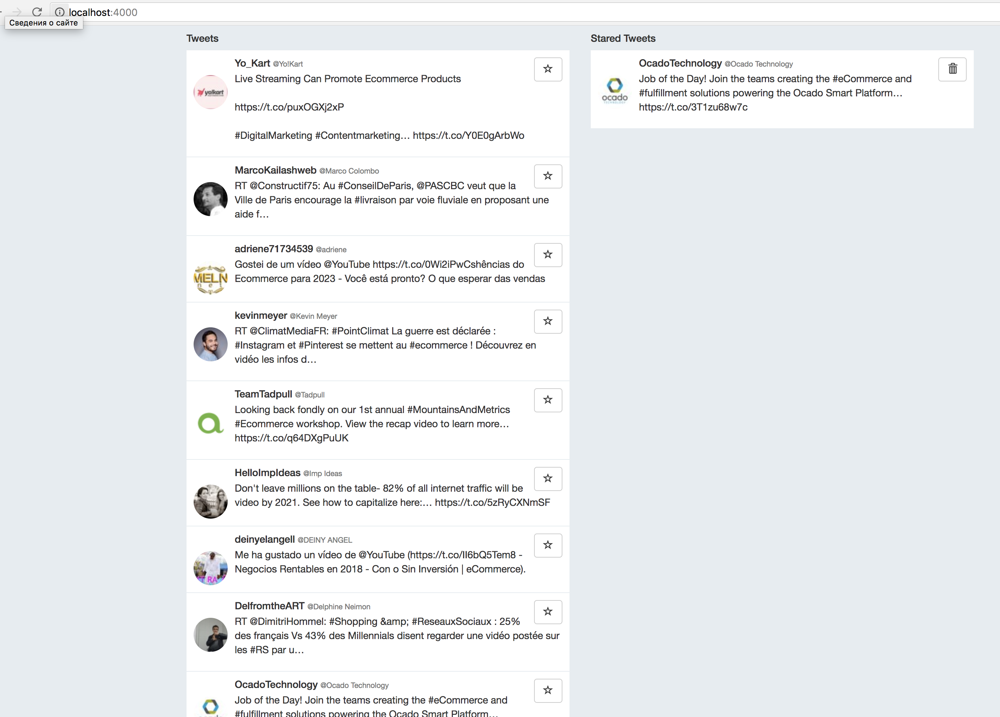

# Twitter Test

This project contain two parts: Backend and frontend.
It's search tweets by keywords from config.
For check how this work you should start both parts.

### Requirements

- Node.js 6.2+
- PostgreSQL server
- Angular Cli Tool

### Installation

Please check `server/config.js` before start, for make sure you have configuration for database and twitter account 

- `git clone https://github.com/YaphetS1/tweet-test.git`
- `cd tweet-test`
- `npm i`
- `npm start`
- Now follow to `http://localhost:4000` in your browser

